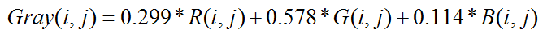

## 学习笔记：验证码识别之图像类验证码

参考链接：

 https://www.php.cn/python-tutorials-157766.html 

###### [Python图片验证码降噪 — 8邻域降噪]

 https://www.cnblogs.com/jhao/p/10345853.html 

###### 【python验证码识别教程之灰度处理、二值化、降噪与tesserocr识别】

  https://www.php.cn/python-tutorials-400595.html 

###### [验证码识别 图像降噪 Python (一）]

  https://www.cnblogs.com/xuchunlin/p/9234455.html 

###### **【图片的灰度化与二值化**】

 https://blog.csdn.net/ldx19980108/article/details/81254930?utm_medium=distribute.pc_relevant.none-task-blog-BlogCommendFromMachineLearnPai2-2.nonecase&depth_1-utm_source=distribute.pc_relevant.none-task-blog-BlogCommendFromMachineLearnPai2-2.nonecase 

1、图像类，**这类验证码大多是数字、字母的组合，国内也有使用汉字的。在这个基础上增加噪点、干扰线、变形、重叠、不同字体颜色等方法来增加识别难度。

**2、相应的，验证码识别大体可以分为下面几个步骤：**

1. 灰度处理
2. 增加对比度(可选)
3. 二值化
4. 降噪
5. 倾斜校正分割字符
6. 建立训练库
7. 识别

## **3、灰度处理：**

 灰度图像上每个像素的颜色值又称为灰度，指黑白图像中点的颜色深度，范围一般从0到255，白色为255，黑色为0。所谓灰度值是指色彩的浓淡程度，灰度直方图是指一幅数字图像中，对应每一个灰度值统计出具有该灰度值的象素数。

　　灰度就是没有色彩，RGB色彩分量全部相等。如果是一个二值灰度图象，它的象素值只能为0或1，我们说它的灰度级为2。用个例子来说明吧：一个256级灰度的图象，如果RGB三个量相同时，如：RGB(100,100,100)就代表灰度为100，RGB(50,50,50)代表灰度为50。

　　现在大部分的彩色图像都是采用RGB[颜色模式](http://zhidao.baidu.com/search?word=颜色模式&fr=qb_search_exp&ie=utf8)，处理图像的时候，要分别对RGB三种分量进行处理，实际上RGB并不能反映图像的形态特征，只是从光学的原理上进行颜色的调配。

　　图像灰度化处理可以作为图像处理的预处理步骤，为之后的图像分割、图像识别和图像分析等上层操作做准备。

------

　　图像灰度化处理有以下几种方式：

　　**1. 分量法**

　　将彩色图像中的三分量的亮度作为三个灰度图像的灰度值，可根据应用需要选取一种灰度图像。

　　 

　　**2. 最大值法**

　　将彩色图像中的三分量亮度的最大值作为灰度图的灰度值。

　

　　**3. 平均值法**

　　将彩色图像中的三分量亮度求平均得到一个灰度值。

　　**4. 加权平均法**

　　根据重要性及其它指标，将三个分量以不同的权值进行加权平均。由于人眼对绿色的敏感最高，对蓝色敏感最低，因此，按下式对RGB三分量进行加权平均能得到较合理的灰度图像。

　

## 4、二值化

二值化（Thresholding）是图像分割的一种最简单的方法。二值化可以把灰度图像转换成二值图像。把大于某个临界灰度值的像素灰度设为灰度极大值，把小于这个值的像素灰度设为灰度极小值，从而实现二值化。

根据阈值选取的不同，二值化的算法分为固定阈值和自适应阈值。 比较常用的二值化方法则有：双峰法、P参数法、迭代法和OTSU法等。

OTSU算法
用了OTSU算法来实现二值化，OTSU（大津法）是属于最大类间方差法，它是自适应计算单阈值的简单高效方法。

### **实现思路**

统计灰度值的直方分布
分别计算背景图像、前景图像的平均灰度、背景图像像素数所占比例
遍历0~255各灰阶，计算并寻找类间方差极大值所对应灰度值
计算公式的推导：
记i为前景与背景的分割阈值；
前景点数占图像比例为w0，平均灰度为u0；
背景点数占图像比例为w1，平均灰度为u1。
图像的总平均灰度为：u=w0*u0+w1*u1。
从最小灰度值到最大灰度值遍历i，当i使得值g=w0*(u0-u)^2+w1*(u1-u)^2 最大时i即为分割的最佳阈值。
利用w0+w1=1，u=w0*u0+w1*u1可推导出等价公式：g=w0*w1*(u0-u1)^2。

## 5、降噪

 接下来尝试去除干扰线，常见的4邻域、8邻域算法。所谓的X邻域算法，可以参考手机九宫格输入法，按键5为要判断的像素点，4邻域就是判断上下左右，8邻域就是判断周围8个像素点。如果这4或8个点中255的个数大于某个阈值则判断这个点为噪音，阈值可以根据实际情况修改。

 